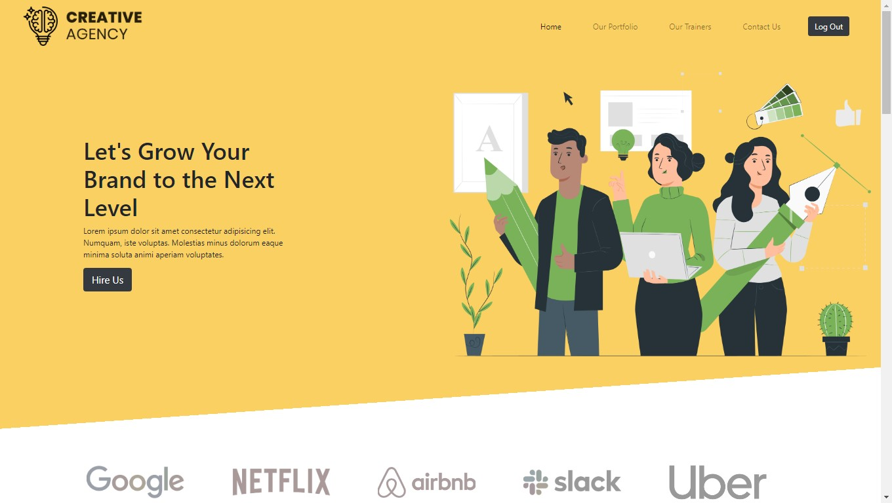

# Creative Agency

[https://creative-agency-frontend-7fa96.web.app/](https://creative-agency-frontend-7fa96.web.app/)

A full-stack agency app where you can take any courses that the agency offers.  User panel shows the courses enrolled and user can review any of the courses which will be displayed in the UI. separate admin panel for admins where they can add courses and checkout user list. 

## Features
- Selection of any skills that the user wants to learn
- Separate User and admin dashboard
- User Authentication using Google

## Technologies
- React
- React Context API
- React Router
- Bootstrap
- Node.js
- MongoDB
- Firebase Authentication
- Heroku
